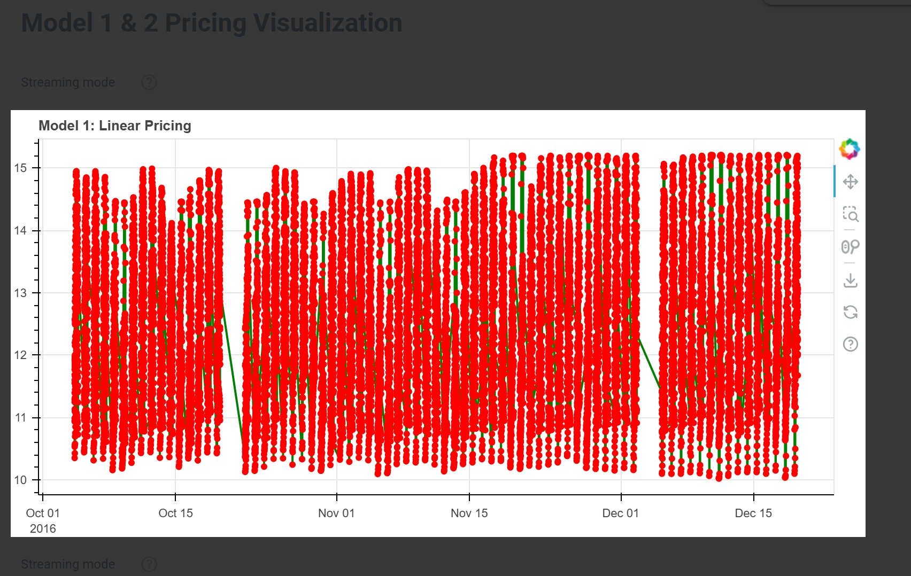
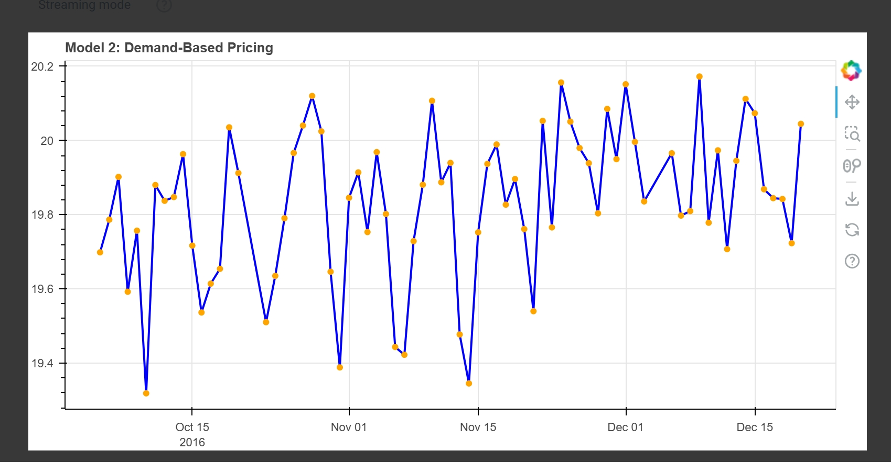

# Dynamic Parking Pricing Models - Summer Analytics Capstone Project 2025

## 📌 Project Overview

This project focuses on building dynamic pricing models for urban parking spaces using real-time streaming data. We explored different models to predict and adjust parking prices based on occupancy, temporal demand, and simulated real-world factors like queue lengths and traffic levels. Implemented using Pathway, Panel, and Bokeh, this solution showcases pricing strategies that adapt to varying demand across time.

## 📂 Repository Contents

- Dynamic Parking Pricing.ipynb — Main Google Colab notebook with full implementation.

- parking_stream_model1.csv — Processed CSV for Models 1 & 1B.

- parking_stream_model2.csv — Processed CSV with added demand-related features for Model 2.

## ⚙️ Models Implemented

### Model 1: Linear Demand-Based Pricing

Formula: price = base_price + alpha * (occupancy / capacity)

- Base price: Rs. 10

- Alpha: 5 (demand sensitivity)

- Assumes demand increases linearly with occupancy.

### Model 1B: Daily Fluctuation Pricing

Formula: price = 10 + (occ_max - occ_min) / capacity

- Calculates daily variation in occupancy.

- Adjusts price based on demand volatility.

- Normalized fluctuation added to base price.

### Model 2: Composite Demand Function with External Factors

Formula:

price = 10 \
    + (avg_occupancy / capacity) * 5 \
    + avg_queue_length * 0.3 \
    + avg_traffic * 0.2 \
    + 5 if special_day else 0 \
    + (vehicle_type_weight_avg - 1) * 10

- Queue Length and Traffic simulate real-world congestion.

- IsSpecialDay boosts prices on holidays/events.

- VehicleTypeWeight adjusts for larger/special vehicles.

## 📈 Demand Function Explanation

We modeled demand primarily through occupancy rate, but in Model 2 extended it with features such as:

- Queue Length (proxy for excess demand)

- Traffic Level (indicates accessibility or rush)

- Special Day Effect (increased likelihood of demand surges)

- Vehicle Type (premium pricing logic)

These features are aggregated daily using Pathway's windowing capability.

## 📎 Assumptions

- Real-time Data is simulated using Pathway's replay_csv().

- Occupancy reflects real demand accurately.

- Traffic/Queue data is synthetically generated but simulates plausible variations.

- All parking spaces have fixed maximum capacity.

- No real competition data available — hence, it's modeled via demand volatility.

## 💰 How Pricing Responds to Demand & Competition

- Higher occupancy → higher price.

- More fluctuation (high peak/low trough) → price increase.

- Queue buildup → reflects unmet demand → higher price.

- Special day → surges price.

-  Vehicle type → premium vehicles are charged more.

 Although we did not incorporate real-time competitor pricing, Model 1B's volatility component mimics competition-driven scarcity pricing — higher fluctuations imply higher competition for parking.

## 🔧 Tools & Libraries Used

- Python, Pandas, NumPy

- Pathway for stream processing

- Panel + Bokeh for interactive plots

## Insights & Future Work

- Adding real competition signals (e.g. nearby parking lot prices).

- Integrating weather/road condition APIs.

- Reinforcement learning for continuous price optimization.

## 📊 Visualization Screenshot

 
 

